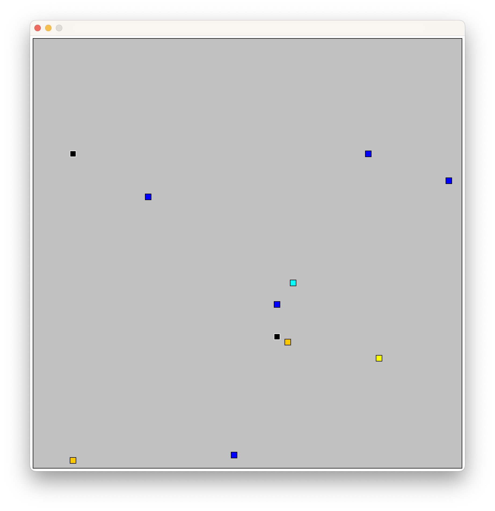

# Cat and Mouse...
...and poison mouse and zombie cat. Simulates a world with mice, cats, poison mice, and zombie cats. The world is a 2D grid, and each creature has a position and a direction. The creatures move around the grid, some searching for another creature to chase, and if they encounter another creature, they may die or poison a creature. The creatures have different behaviors, and the simulation is randomized.



## Usage

```console
$ make
$ java Simulator [initial number of mice] [initial number of poison mice] [initial number of cats] [initial number of zombie cats] [rounds] [randSeed] | java -jar Plotter.jar [time between rounds]
```

(If the `make` command fails, try running `make clean` before.)

Example:
```console
$ make
$ java Simulator 8 2 2 0 1000 42 | java -jar Plotter.jar 40
```

## Color Representation
| Color | Creature |
| --- | --- |
| Blue | Mouse |
| Orange | Poison Mouse |
| Yellow | Cat (not chasing) |
| Cyan | Cat (chasing) |
| Red | Zombie Cat (not chasing) |
| Black | Zombie Cat (chasing) |
